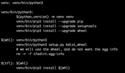

.. # Copyright (C) 2020 Intel Corporation
.. # Licensed subject to the terms of the separately executed evaluation license agreement between Intel Corporation and you.

Baremetal Installation
######################

.. note::

   Make sure you've run the :ref:`install.installing:Initial Steps` section first.

1.	Build the virtual environment using the command:

.. code-block:: console

   $ make install

This should create a Python 3 virtual environment with the required
packages (e.g. TensorFlow, PyTorch, OpenCV, nibabel) that are used by
the aggregator and the collaborators. Note that you can add custom
Python packages by editing this section in the Makefile.

   :scale: 50 %

   How to install a custom package in the virtual environment.

Just add your own line. For example,

.. code-block:: console

   venv/bin/pip3 install my_package
