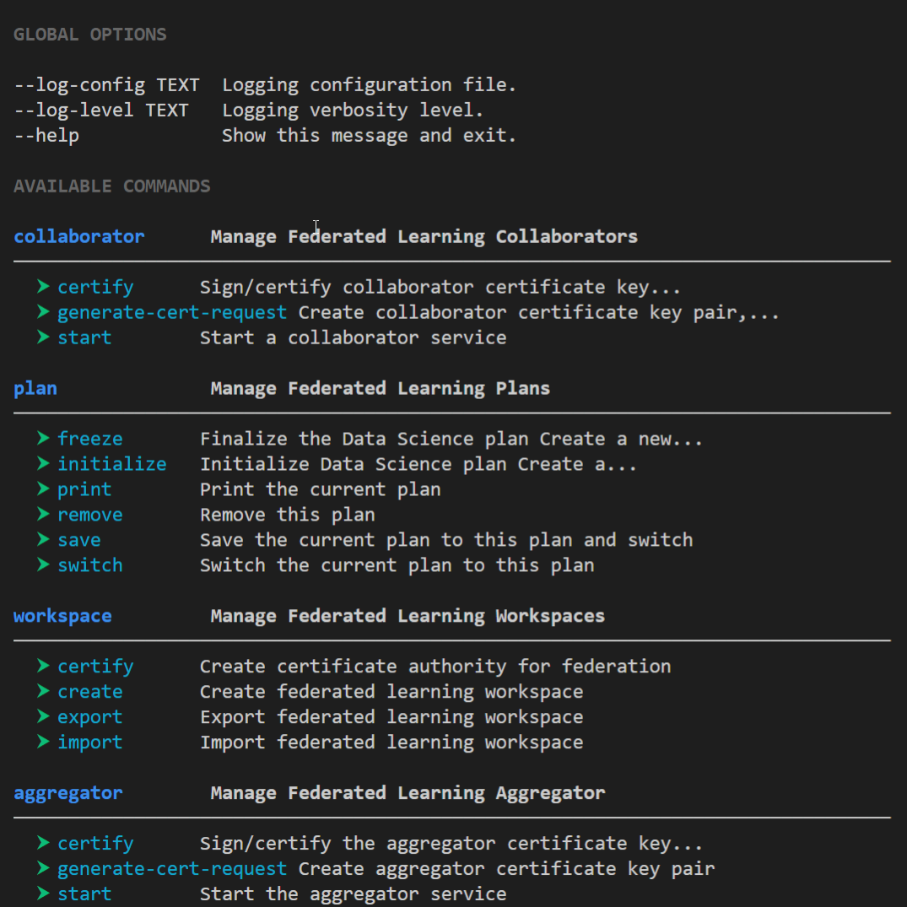

.. # Copyright (C) 2020 Intel Corporation
.. # Licensed subject to the terms of the separately executed evaluation license agreement between Intel Corporation and you.

.. _install_initial_steps:

Initial Steps
#############

1. Install Python 3.6 virtual environment. Conda is preferred, but other virtual environments should work as well.
Conda can either be installed via the `Anaconda <https://www.anaconda.com/products/individual>`_ 
or `Miniconda <https://docs.conda.io/en/latest/miniconda.html>`_ distributions.  

Once :code:`conda` is installed you may need to logout and back in for the changes to take effect.

2. Create a new conda environment for the project.

.. code-block:: console

      $ conda create -n env_name pip python=3.6

3. Activate the virtual environment.

.. code-block:: console

      $ conda activate env_name 

4.	Unzip the source code |productZip|

.. code-block:: console
   :substitutions:

   $ unzip |productZip|

5.	Change into the project directory.

.. code-block:: console
   :substitutions:

   $ cd |productDir|

6. Install |productName| package:

.. code-block:: console

  $ pip install .

7. At this point |productName| should be available within the virtual environment. 
To test, run the :code:`fx` command. This command is only available within this virtual environment.

   fx command