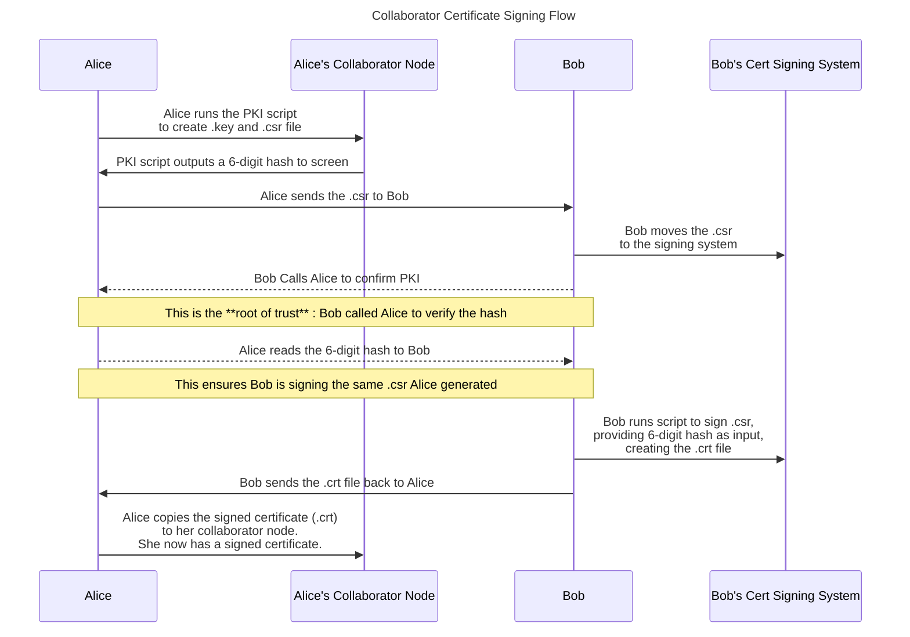

```mermaid
sequenceDiagram
Title: Collaborator Certificate Signing Flow 
  participant A as Alice
  participant AC as Alice's Collaborator Node
  participant B as Bob
  participant BG as Bob's Cert Signing System
  A->>AC: Alice runs the PKI script<br>to create .key and .csr file
  AC->>A: PKI script outputs a 6-digit hash to screen
  A->>B: Alice sends the .csr to Bob
  B->>BG: Bob moves the .csr<br/> to the signing system
  B-->>A: Bob Calls Alice to confirm PKI
  Note over A,B: This is the **root of trust** : Bob called Alice to verify the hash 
  A-->>B: Alice reads the 6-digit hash to Bob
  Note over A,B: This ensures Bob is signing the same .csr Alice generated
  B->>BG: Bob runs script to sign .csr,<br/> providing 6-digit hash as input,<br/> creating the .crt file
  B->>A: Bob sends the .crt file back to Alice
  A->>AC: Alice copies the signed certificate (.crt)<br/>to her collaborator node.<br/>She now has a signed certificate.
  
```