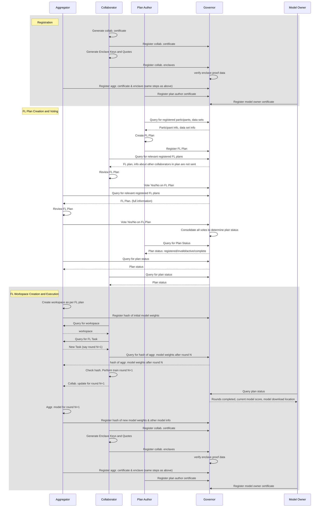

```mermaid
sequenceDiagram
    rect rgb(225, 225, 225)
    participant A as Aggregator
    participant C as Collaborator
    participant PA as Plan Author
    participant G as Governor
    participant MO as Model Owner
    Note left of A: Registration
    C->>C: Generate collab. certificate
    C->>G: Register collab. certificate
    C->>C: Generate Enclave Keys and Quotes
    C->>G: Register collab. enclaves
    G->>G: verify enclave proof data
    A->>G: Register aggr. certificate & enclave (same steps as above)
    PA->>G: Register plan author certificate
    MO->>G: Register model owner certificate
    end
    Note left of A: FL Plan Creation and Voting
    PA->>G: Query for registered participants, data sets
    G-->>PA: Participant info, data set info
    PA->>PA: Create FL Plan
    PA->>G: Register FL Plan
    C->>G: Query for relevant registered FL plans
    G-->>C: FL plan, info about other collaborators in plan are not sent
    C->>C: Review FL Plan
    C->>G: Vote Yes/No on FL Plan
    A->>G: Query for relevant registered FL plans
    G-->>A: FL Plan. (full information)
    A->>A: Review FL Plan
    A->>G: Vote Yes/No on FL Plan
    G->>G: Consolidate all votes to determine plan status
    PA->>G: Query for Plan Status
    G-->>PA: Plan status: registered/invalid/active/complete
    A->>G: Query for plan status
    G-->>A: Plan status
    C->>G: Query for plan status
    G-->>C: Plan status
    rect rgb(225, 225, 225)
    Note left of A: FL Workspace Creation and Execution
    A->>A: Create workspace as per FL plan
    A->>G: Register hash of initial model weights
    C->>A: Query for workspace
    A-->>C: workspace
    C->>A: Query for FL Task
    A-->>C: New Task (say round N+1)
    C->>G: Query for hash of aggr. model weights after round N
    G-->>A: hash of aggr. model weights after round N
    C->>C: Check hash. Perform train round N+1
    C-->>A: Collab. update for round N+1
    MO->>G: Query plan status
    G-->>MO: Rounds completed, current model score, model download location
    A->>A: Aggr. model for round N+1
    A->>G: Register hash of new model weights & other model info
    C->>G: Register collab. certificate
    C->>C: Generate Enclave Keys and Quotes
    C->>G: Register collab. enclaves
    G->>G: verify enclave proof data
    A->>G: Register aggr. certificate & enclave (same steps as above)
    PA->>G: Register plan author certificate
    MO->>G: Register model owner certificate
    end
```