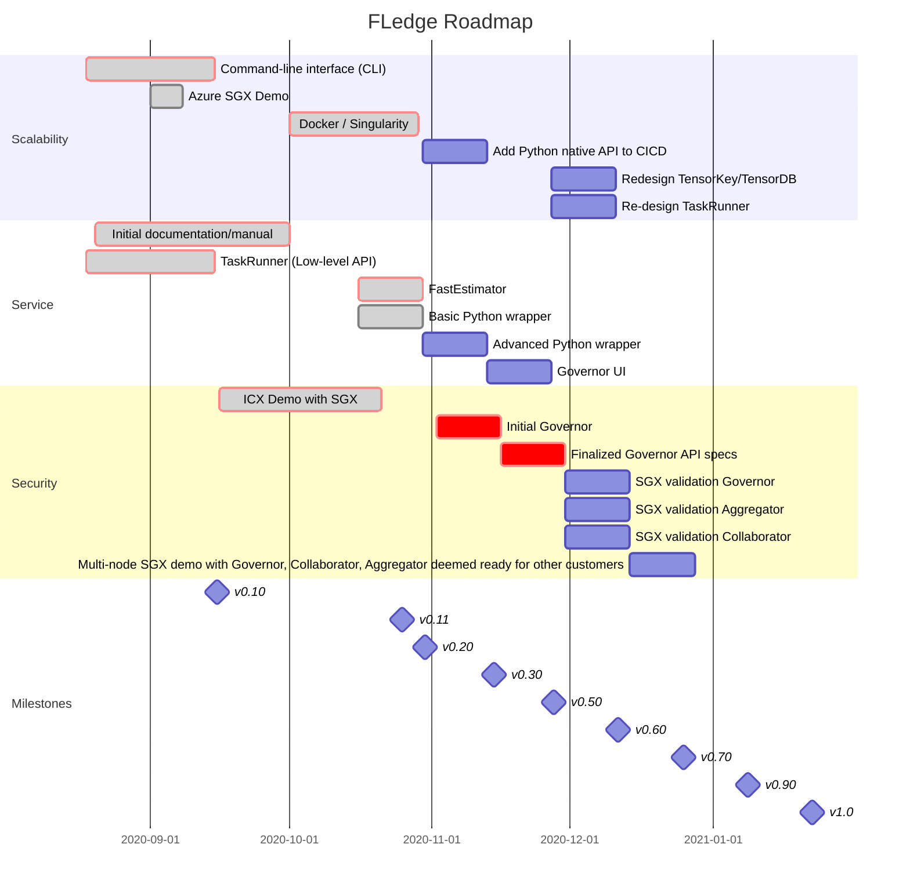

```mermaid
gantt

    dateFormat  YYYY-MM-DD
    title FLedge Roadmap
    %% Intel IOTG Federated Learning

    section Scalability

        Command-line interface (CLI)  : done, crit, tag_cli, 2020-08-18, 4w
        Azure SGX Demo                : done, tag_azure_demo, 2020-09-01, 1w
        Docker / Singularity           : crit, done, tag_container, 2020-10-01, 4w
        Add Python native API to CICD : tag_python_api_cicd, 2020-10-30, 2w
        Redesign TensorKey/TensorDB   : tag_tensorkey, 2020-11-27, 2w
        Re-design TaskRunner          : tag_taskrunner, 2020-11-27, 2w

    section Service

        Initial documentation/manual : done, crit, tag_docs, 2020-08-20, 6w
        TaskRunner (Low-level API)   : done, crit, tag_lowlevel, 2020-08-18, 4w
        FastEstimator                : crit, done, tag_fastestimator, 2020-10-16, 2w
        Basic Python wrapper         : done, tag_basicpython, 2020-10-16, 2w
        Advanced Python wrapper      : tag_advanced_python, after tag_basicpython, 2w
        Governor UI                  : tag_governor, after tag_advanced_python, 2w
        
    section Security

        ICX Demo with SGX : done, crit, tag_icx_demo, 2020-09-16, 5w
        Initial Governor  : crit, tag_init_governor, 2020-11-02, 2w

        Finalized Governor API specs : crit, tag_final_api_gov, 2020-11-16, 2w

        SGX validation Governor     : tag_valid_governor, after tag_final_api_gov, 2w
        SGX validation Aggregator   : tag_valid_aggregator, after tag_final_api_gov, 2w
        SGX validation Collaborator : tag_valid_collaborator, after tag_final_api_gov, 2w

        Multi-node SGX demo with Governor, Collaborator, Aggregator deemed ready for other customers : tag_1.0, 2020-12-14, 2w

    section Milestones

        v0.10 : milestone, v0.10, 2020-09-15, 1d
        v0.11 : milestone, v0.11, 2020-10-25, 1d
        v0.20 : milestone, v0.20, 2020-10-30, 1d
        v0.30 : milestone, v0.30, 2020-11-14, 1d
        v0.50 : milestone, v0.50, 2020-11-27, 1d
        v0.60 : milestone, v0.60, 2020-12-11, 1d
        v0.70 : milestone, v0.70, 2020-12-25, 1d
        v0.90 : milestone, v0.90, 2021-01-08, 1d
        v1.0  : milestone, v1.0,  2021-01-22, 1d
```     